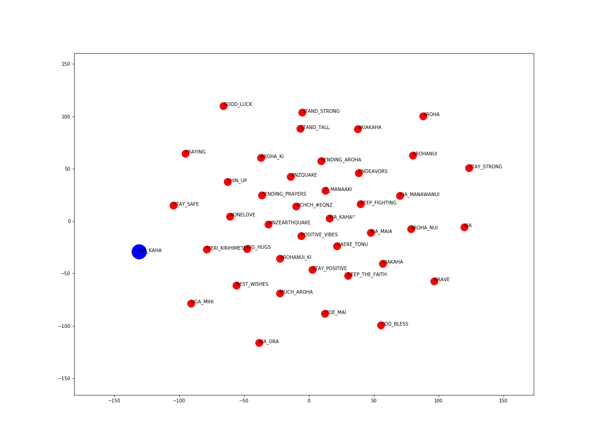
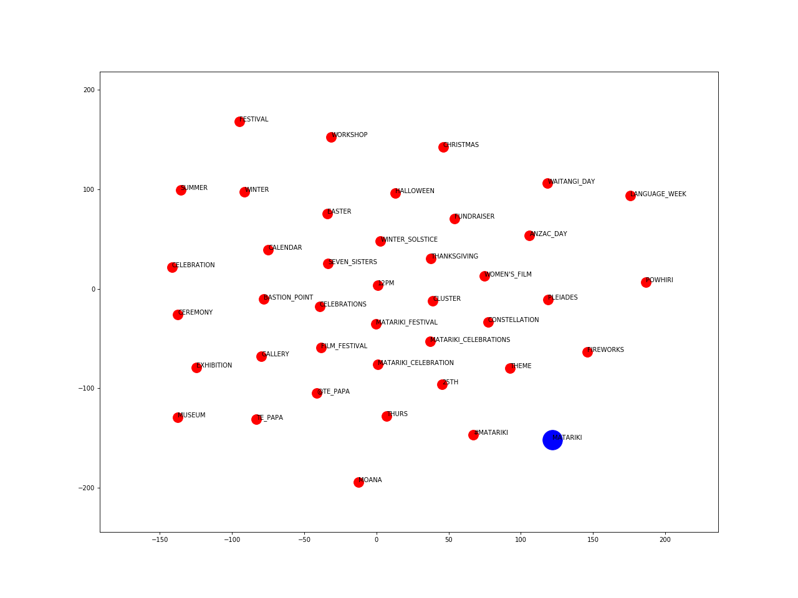
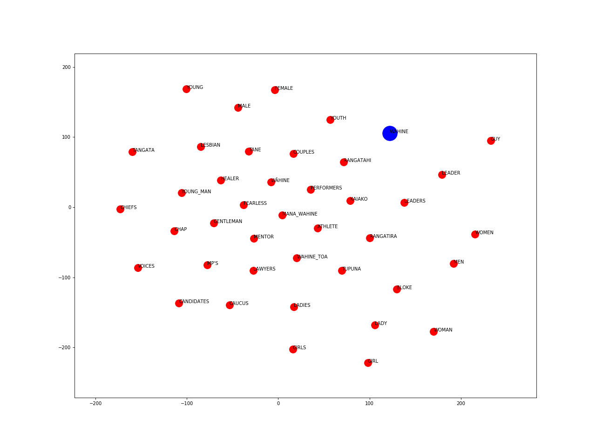

# Māori Loanwords in Twitter
Code for analysing the usage of Māori Loanwords in New Zealand Tweets

## Word Embeddings Visualisations

The visualisations from below were obtained after training Word2Vec embeddings on the corpus of tweets. Hyperparameters are optimised by minimising the median ranking of a list of given word pairs.  

The vectors are projected to a two-dimensional space using the TSNE method. 

