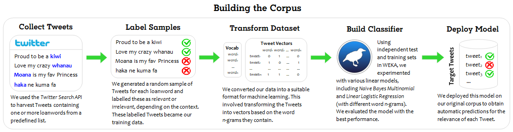

# NZT Corpus
The <i>New Zealand Twitter Corpus (NZT Corpus)</i> is a diachronic corpus consisting of two components: (a) the labelled corpus (4,000 manually-coded Tweets which include at least one Māori word of interest) and (b) the processed corpus (1.2 million Tweets that were classified as relevant, using the labelled corpus as training data). Below is a description of the corpus and a flowchart outlining how it was built. 
  
Key stats:  
Total number of tokens (words): XXX  
Number of Tweets: 1,179,390  
Timeframe: 2008-2018  
Number of Tweeters (authors): XXX  
Number of loanwords used to harvest the data: 77

 
