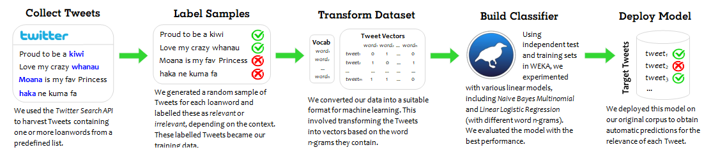

# MLT Corpus
 
The <i>Maori Loanword Twitter Corpus (MLT Corpus)</i> is a diachronic corpus of tweets posted between 2008-2018 that were harvested using 77 Māori words of interest ("query words"). It consists of three key components:

1. <i>Raw Corpus</i>: 1.6 million Tweets containing at least one query word, which may or many not be used in a relevant (NZE) context.
2. <i>Labelled Corpus</i>: 3,685 manually inspected Tweets containing query words that are ALL used in relevant contexts. 
3. <i>Processed Corpus</i>: Just under 1.2 million Tweets that were classified as relevant by a machine learning model that used the <i>Labelled Corpus</i> as training data. 

Below is a description of these components and a flowchart outlining how the <i>Processed Corpus</i> was built. 

### Key Stats
| Description          | Raw Corpus | Labelled Corpus | Processed Corpus |
| ---------------------|------------|-----------------| -----------------|
| Tokens (words)       | 28,804,640 | 49,477          | 21,810,637       |
| Tweets               | 1,628,042  | 2,495           | 1,179,390        |
| Tweeters (authors)   | 604,006    | 1,866           | 426,280          |

### Building the Corpus
 
