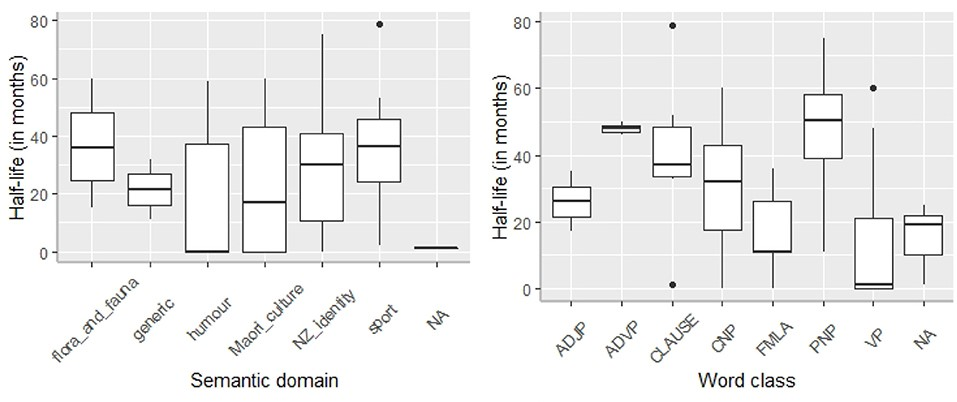

# Loanword Twitter Corpus
The *Māori Loanword Twitter (MLT) Corpus* is a diachronic corpus of nearly 3 million New Zealand English tweets, posted between 2008 and 2018. The data was collected by extracting tweets containing one or more terms from a list of 77 Māori words and phrases. We then used computational machine learning methods to clean up the raw data, because many of the tweets were not relevant to a New Zealand English context (for instance, the loanword <i>Moana</i>, meaning sea, is commonly used to refer to the Disney film/princess).

The corpus consists of three key components:

1. <i>Raw Corpus</i>: The original dataset, which includes many irrelevant (non-New Zealand English) tweets.
2. <i>Labelled Corpus</i>: 3,685 tweets that were manually labelled as "relevant" or "irrelevant" and used as training data for our model.
3. <i>Processed Corpus</i>: The final version of the corpus, containing only tweets that the model classified as relevant.

### Building the MLT Corpus
Below is a visual representation of the steps involved in building the corpus.

For further information, see [our paper](https://www.aclweb.org/anthology/P19-2018/). 

### Summary Statistics
This table shows key stats for the different components of the MLT Corpus:

| Description          |Raw Corpus V2*| Labelled Corpus | Processed Corpus V2*|
| ---------------------|--------------|-----------------|---------------------| 
| Tokens (words)       | 70,964,941   |49,477           | 46,827,631          | 
| Tweets               | 4,559,105    | 2,495           | 2,880,211           |
| Tweeters (authors)   | 1,839,707    | 1,866           | 1,226,109           |

\*Please note that these statistics differ from what is stated in the paper, because we later refined our classifier, opting for a Naive Bayes Multinomial model that considered both unigrams and bigrams. 

### Word Vectors  
The following visualisations were created by training Word2Vec embeddings on the Māori Loanword Twitter (MLT) Corpus. Hyper-parameters were optimised by minimising the median ranking of a list of given word pairs. The vectors are projected into two-dimensional space using the t-SNE method. 

Aroha (love):

Whānau (family):

Click to <a href="../pics/word_vectors.zip">download all word vector plots</a> (including other loanwords).

### Download the MLT Corpus
Click to <a href="../pics/mlt-v2.zip">download the MLT Corpus</a>.

### Citing the MLT Corpus
If you use the MLT corpus, please cite the following paper:

- Trye, D., Calude, A., Bravo-Marquez, F., Keegan, T. T. (2019). [Māori loanwords: A corpus of New Zealand English tweets](https://www.aclweb.org/anthology/P19-2018/). In <i>Proceedings of the 57th Annual Meeting of the Association for Computational Linguistics: Student Research Workshop</i>, pp. 136–142. Florence, Italy: Association for Computational Linguistics. doi:10.18653/v1/P19-2018. 

### Hybrid Hashtags
The *Hybrid Hashtag (HH) Sub-Corpus* is a subset of tweets in the MLT Corpus containing hashtags made up of Māori and English words (so-called "hybrid hashtags"). There are 81 hybrid hashtags in this dataset, used in 5,684 tweets and posted to Twitter by 3,771 distinct users. Popular hashtags include #waitangiday, #maorilanguageweek, #gokiwi, #proudkiwi, #kiwipride and #letssharegoodtereostories.

### Download the HH Sub-Corpus
Click to <a href="../pics/hh_corpus.xlsx">download the HH Sub-Corpus</a>.

### Citing the HH Sub-Corpus
If you use the Hybrid Hashtag Sub-Corpus, please cite the following paper:

- Trye, D., Calude, A. S., Bravo-Marquez, F., & Keegan, T. T. (2020). [Hybrid Hashtags: #YouKnowYoureAKiwiWhen Your Tweet Contains Māori and English](https://www.frontiersin.org/articles/10.3389/frai.2020.00015/full). <i>Front. Artif. Intell.</i> 3:15. doi:10.3389/frai.2020.00015.

### Media Attention

- Article in *The Conversation*, [Hashtags may not be words, grammatically speaking, but they help spread a message](https://theconversation.com/hashtags-may-not-be-words-grammatically-speaking-but-they-help-spread-a-message-133045), 3 November 2020
- Interview for Stuff NZ, [*Māori loanwords enrich Twitter*](https://www.stuff.co.nz/science/113958987/mori-loanwords-enrich-twitter), 8 July 2019
- Interview for Radio NZ, [*NZ’s unique te reo tweets*](https://www.radionz.co.nz/news/te-manu-korihi/382254/nz-s-unique-te-reo-tweets), 12 February 2019
- Coverage from the University of Waikato, [*When machine learning, Twitter and te reo Māori merge*](https://www.waikato.ac.nz/news-opinion/media/2019/when-machine-learning-twitter-and-te-reo-maori-merge), 11 February 2019

### Team

- [David Trye](https://www.cs.waikato.ac.nz/~dgt12/)
- [Andreea S. Calude](https://www.calude.net/andreea/)
- [Te Taka Keegan](https://www.cms.waikato.ac.nz/people/tetaka)

External Collaborators:

- [Felipe Bravo Marquez](https://felipebravom.com/), University of Chile, Chile
- [Nicole Chan](https://www.linkedin.com/in/hi-nicole-chan), Industry, NZ

### Funding

We graciously acknowledge the generous support of:

- Marsden Fund, Royal Society of New Zealand
