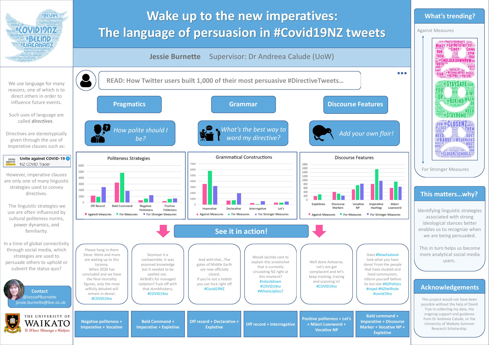

# Covid NZ Twitter Corpus 
The *Covid NZ Twitter (CovidNZT) Corpus* consists of 40,243 tweets obtained between 22 February and 10 November 2020 (1,001 of which have been manually coded). All tweets contain the hashtag #covid19nz, including variations with one or more capital letters. The aim of the project is to study linguistic strategies which tweeters use to express their viewpoints and stance in Covid-related tweets. In particular, one of our points of interests is the use of directives.

This work is just beginning and we will have more details in due course. If you would like to talk to us about this project, please [email Andreea Calude](mailto:andreea@waikato.ac.nz).

### Download the CovidNZT Corpus
We are working on this.

### Citing the CovidNZT Corpus
Coming soon - watch this space!

### Team

- [Jessie Burnette](https://www.linkedin.com/in/jessie-burnette-9b243933?lipi=urn%3Ali%3Apage%3Ad_flagship3_profile_view_base_contact_details%3B5mMkT4FJT5qBJPmE8W8UzA%3D%3D)
- [David Trye](https://www.cs.waikato.ac.nz/~dgt12/)
- [Andreea S. Calude](https://www.calude.net/andreea/)

### Funding
We graciously acknowledge the generous support of:

- The University of Waikato Summer Scholarship
