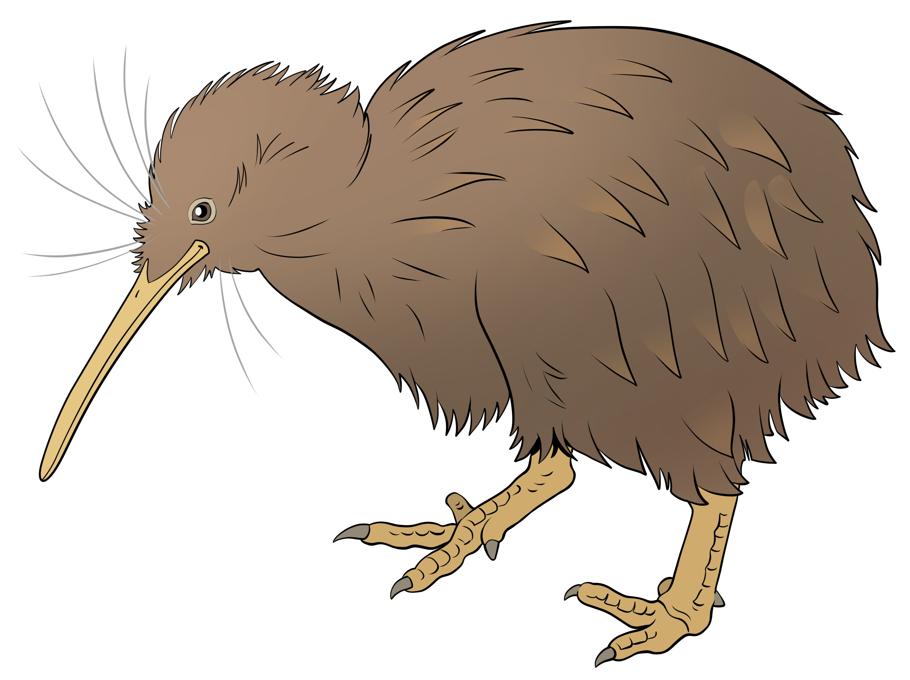

# Welcome to Kiwi Words!

This website documents research on languages spoken in Aotearoa New Zealand, carried out by academics at the [University of Waikato](https://www.waikato.ac.nz/), NZ. Specifically, our projects describe and analyse **te reo Māori** (the indigenous language of the country) and **varieties of English** spoken on the shores of Aotearoa New Zealand.

Each project has a different focus and makes use of different data (all of which is collected by Waikato researchers in conjunction with our collaborators). The various tabs provide information on the different projects, their main objective, the specific team of researchers involved and arising publications or media attention.

 We are grateful to our funders for their generous support: 

### GitHub Repository

Our [GitHub repository](https://github.com/Waikato/kiwiwords/) provides relevant code for each project (e.g. for collecting, cleaning and analysing the data).

### Get in touch

If you would like to get in touch with us, please email [Andreea Calude](https://www.calude.net/andreea/) for general research inquiries (andreea@waikato.ac.nz) and [David Trye](https://www.cs.waikato.ac.nz/~dgt12/) for website admin and data downloading inquiries (dtrye@waikato.ac.nz).

### Publications

- Burnette, J., & Long, M. (2022). [Bubbles and lockdown in Aotearoa New Zealand: the language of self-isolation in #Covid19NZ tweets](https://mh.bmj.com/content/early/2022/07/27/medhum-2022-012401). *Medical Humanities*. doi:10.1136/medhum-2022-012401
- Burnette, J., & Calude, A. S. (2022). [Wake up New Zealand! Directives, politeness and stance in Twitter #Covid19NZ posts](https://www.sciencedirect.com/science/article/abs/pii/S0378216622001266). *Journal of Pragmatics*, *196*, 6-23. doi:10.1016/j.pragma.2022.05.002
- Trye, D., Keegan, T. T., Mato, P., & Apperley, M. (2022). [Harnessing Indigenous Tweets: The Reo Māori Twitter corpus](https://link.springer.com/article/10.1007/s10579-022-09580-w). <em>Lang Resources & Evaluation</em>, *56*, 1229-1268. doi:10.1007/s10579-022-09580-w
- Trye, D., Calude, A. S., Bravo-Marquez, F., & Keegan, T. T. (2020). [Hybrid hashtags: #YouKnowYoureAKiwiWhen your tweet contains Māori and English](https://www.frontiersin.org/articles/10.3389/frai.2020.00015/full). <i>Front. Artif. Intell.</i> 3:15. doi:10.3389/frai.2020.00015
- Trye, D., Calude, A., Bravo-Marquez, F., Keegan, T. T. (2019). [Māori loanwords: A corpus of New Zealand English tweets](https://www.aclweb.org/anthology/P19-2018/). In <i>Proceedings of the 57th Annual Meeting of the Association for Computational Linguistics: Student Research Workshop</i>, pp. 136–142. Florence, Italy: Association for Computational Linguistics. doi:10.18653/v1/P19-2018 

Thank you for visiting our website!

