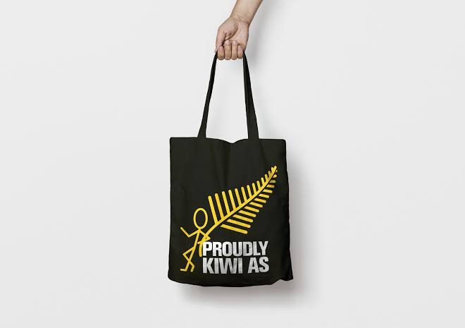

# Māori English Corpus

This project aims to document the fastest growing variety of English spoken currently in Aotearoa New Zealand, Māori English. 

We have recorded and manually transcribed 43 spontaneous dyadic conversations from 49 speakers of Māori English located in and around the Waikato region. Because Māori English distinguishes itself from related varieties of English in relative (rather than absolute) frequencies of various features, it has to date been difficult to clearly capture the nature of this variety. The corpus is currently being analysed and our hope is to use this data to increase understanding of Māori English.

### Contact Information

If you would like to talk to us about this project, please [email Andreea Calude](mailto:andreea@waikato.ac.nz).

### Team

- [Andreea S. Calude](https://www.calude.net/andreea/) (PI)
- [Hēmi Whaanga](https://www.massey.ac.nz/massey/expertise/profile.cfm?stref=882622)

External Collaborators:

- [Anita Szakay](https://researchers.mq.edu.au/en/persons/anita-szakay), Macquarie University, Australia

### Funding

We graciously acknowledge the generous support of:

- The University of Waikato Medium SIF Fund
