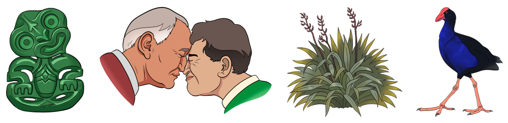

# NZE Lexicon

This project will investigate knowledge of New Zealand English words (both native English words and words borrowed from te reo Māori) believed to be in common use in NZ. We will norm a set of pictures combining a subset of existing pictures normed with other languages including two separate English varieties. The pictures include a set of purpose-drawn illustrations denoting concepts commonly borrowed from te reo Māori. See some pictures from our set below:

Credit for images: Scott Pearson at [Visual Evolution](http://visualevolution.co.nz/wp/)

We will then use these materials to test New Zealand children’s receptive vocabulary knowledge and cultural sensitivity towards the concepts shown.

### Publications

Publications coming soon - watch this space!

### Team

- PI [Andreea S. Calude](https://www.calude.net/andreea/)
- [Hēmi Whaanga](https://www.waikato.ac.nz/fmis/about/staff/hemi)

External Collaborators:

- [Eline Zenner](https://www.arts.kuleuven.be/ling/qlvl/people/pages/00056687), KU Leuven
- [Laura Rosseel](https://researchportal.vub.be/en/persons/laura-rosseel), Vrije Universiteit Brussel 
