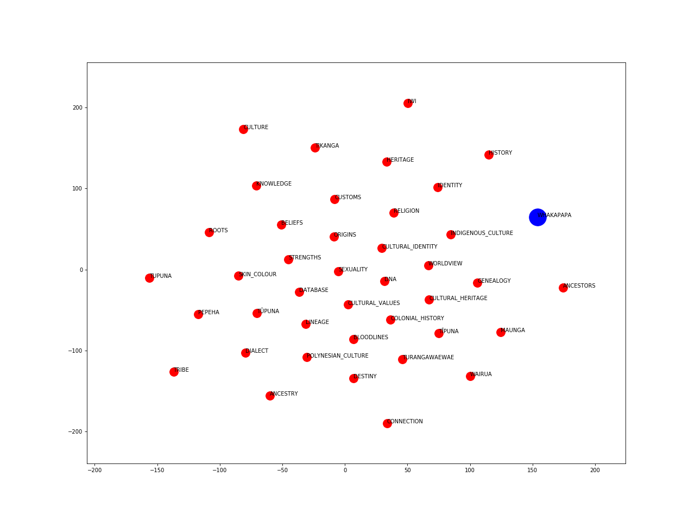

# Word Embeddings Visualisations

The visualisations from below were obtained after training Word2Vec embeddings on the corpus of tweets. Hyperparameters are optimised by minimising the median ranking of a list of given word pairs.  

The vectors are projected into a two-dimensional space using the TSNE method. 

### Whakapapa 

### Aroha

### Haka

### Kia Kaha

### Kia Ora

### Matariki

### Wahine

### Whakapapa

